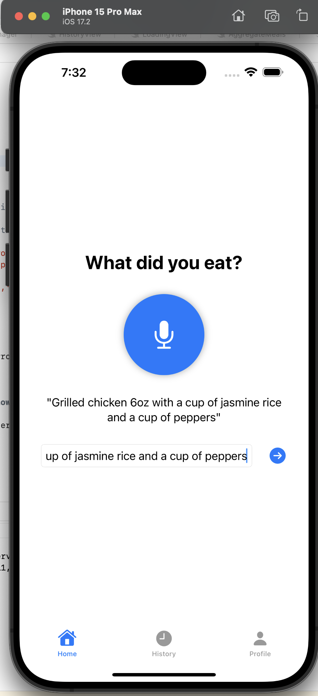
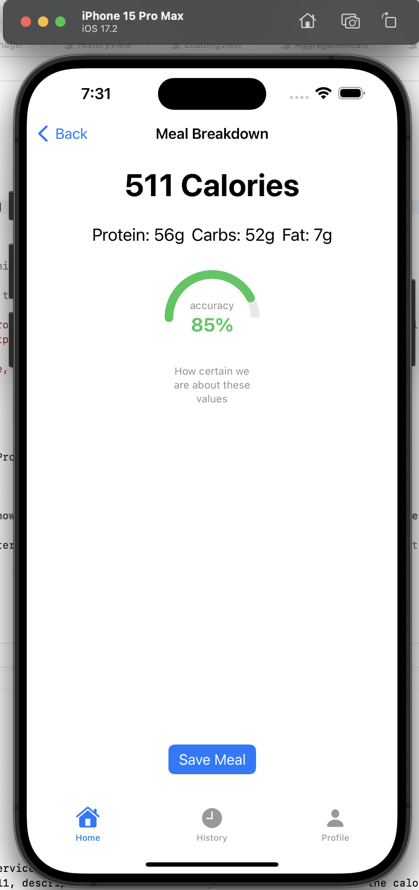
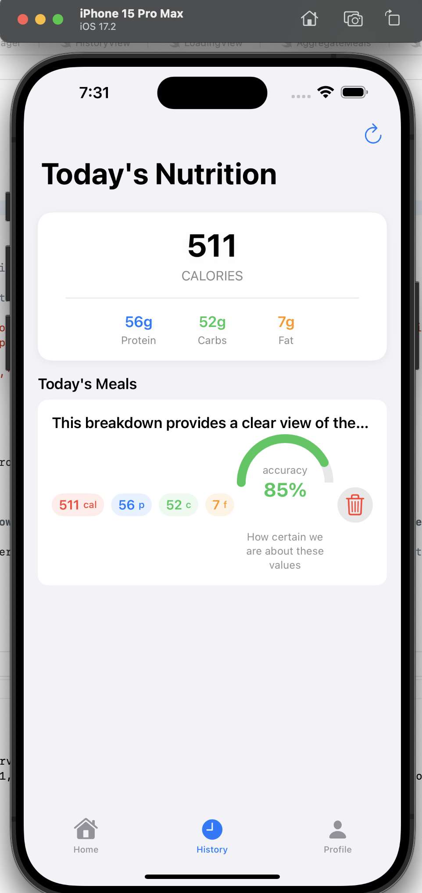

# 🥗 Calify – AI-Powered Calorie & Macro Tracker

Calify is a minimalist iOS app that uses an LLM (GPT-4o) to estimate calories, protein, carbs, and fat from natural language descriptions of meals. Just type (or speak) what you ate — Calify handles the rest.

---

## ⚙️ How It Works

1. **Input your meal** in plain English  
2. **LLM estimates** total calories and macros using structured prompts  
3. **App scores the estimate's accuracy** and adds it to your daily meal history

---

## 📸 Screenshots

### 🔤 Meal Input

---

### 📊 AI Estimate + Accuracy Scoring

---

### 🧾 Daily Summary

---

## 🚧 Status

Calify is currently in active MVP development.  
Next steps include:
- 🧠 Perplexity/USDA fallback for branded food?
- 🗣️ Calendar display for users to view their calories and meal habits on specific days
- 📈 More detailed analytics per day

---

## 🧪 Built With

- Swift + SwiftUI
- [SwiftOpenAI](https://github.com/rochabrun/SwiftOpenAI)
- GPT-4o (via OpenAI API)

---

## 📬 Feedback / Contributions

Open an issue or reach out if you’d like to help improve Calify.

